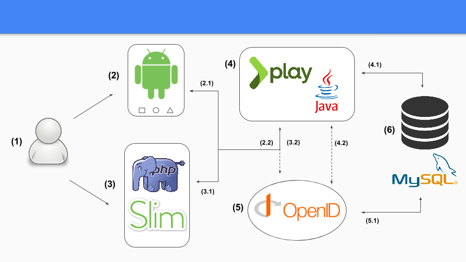

projects
========

Here are located the different repositories that conforms project Willyfog:



* (4) [willyfog-api](https://github.com/popokis/willyfog-api): REST API built with PHP on top of 
[Slim](https://github.com/slimphp/Slim). This is the core of the project.
* (5) [willyfog-openid](https://github.com/popokis/willyfog-openid): OpenID provider thanks to PHP, 
[Slim](https://github.com/slimphp/Slim) and 
[bshaffer/oauth2-server-php](https://github.com/bshaffer/oauth2-server-php).
* (3) [willyfog-web](https://github.com/popokis/willyfog-web): Web application of the project. PHP, [Slim](https://github.com/slimphp/Slim), we meet again.

```
git clone https://github.com/popokis/willyfog-api.git       # API (core)
git clone https://github.com/popokis/willyfog-openid.git    # OpenID provider
git clone https://github.com/popokis/willyfog-web.git       # Web app
```